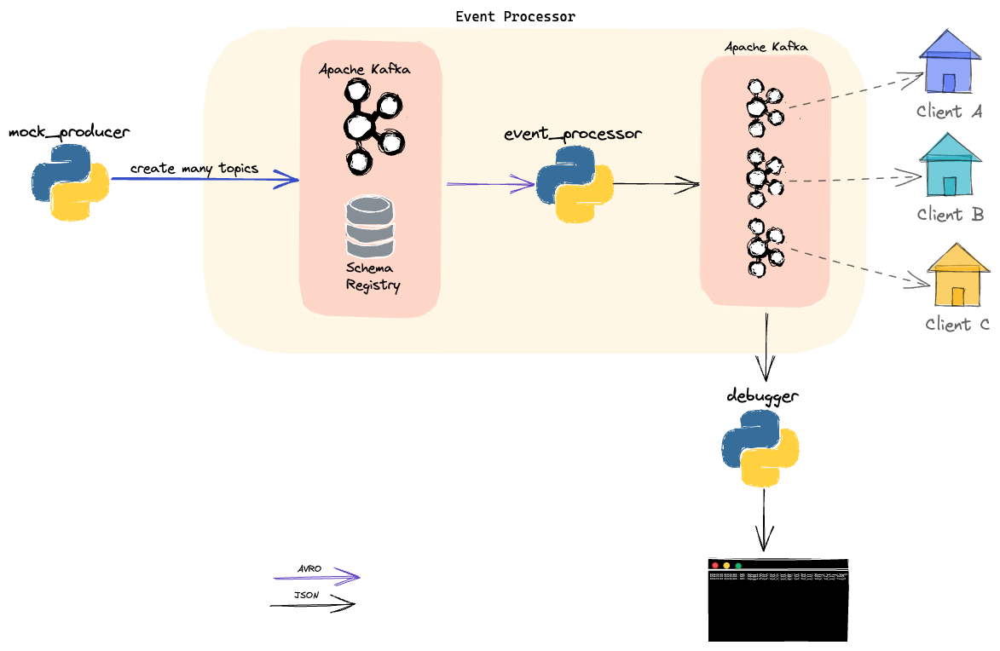

# Challenge Pismo.io

## Desafio
Criar um processador de eventos disponibilizando dados com baixa latência.


## Solução



- mock_producer: responsável por gerar dados para o desafio.
- Apache Kafka e Schema Registry: são como uma "pedra angular". Responsáveis por armazenar dados, gerenciar compatibilidade de schemas e fornecer dados de forma escalável e em baixa latência.
- event_processor: consome dados, valida e separa o respectivo `event_type` para cada cliente (de acordo com de x para pré configurado).
- debugger: mostra mensagens no terminal.

### Versões futuras
- expor dados através de [Rest Proxy](https://docs.confluent.io/platform/current/kafka-rest/index.html) ou REST API proprietária.
- criar webhooks caso HAJA necessidade.
- migrar `event_processor.py` para outra tecnologia mais escalável caso vire um gargalo. [Apache Flink](https://flink.apache.org/), [Siddhi](https://siddhi.io/) ou solução proprietária.

----

## Pré requisitos
- Python 3.9+
- [Poetry](https://python-poetry.org/docs/)
- Docker (ou [colima](https://github.com/abiosoft/colima))

## Como usar
Executar os comandos abaixo na raiz do projeto.

```shell
make kafka-up 
```

```shell
make mock-start
```

```shell
make event-process-start
```

```shell
make debugger-start
```

### Como testar
1- Subir broker Kafka

```shell
make kafka-up 
```

2- Rodar tests

```shell
make tests
```